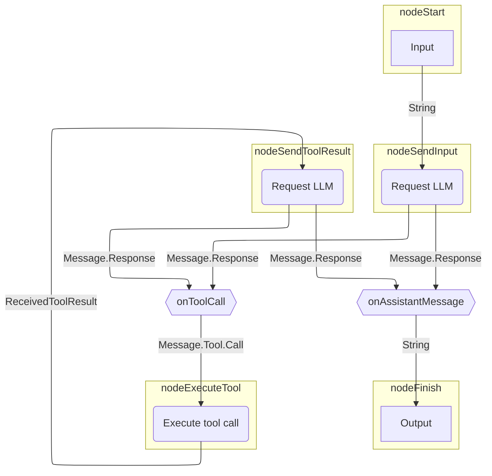
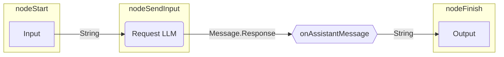

# Graph-based agents

While [basic agents](basic-agents.md) are great for simple tasks with a predefined agent workflow
and [functional agents](functional-agents.md) let you prototype custom logic quickly,
the standard approach is to build your own [strategy graph](../custom-strategy-graphs.md) for the agent.

??? note "Prerequisites"

    --8<-- "getting-started-snippets.md:prerequisites"

    --8<-- "getting-started-snippets.md:dependencies"

    --8<-- "getting-started-snippets.md:api-key"

    Examples on this page assume that you are running Llama 3.2 locally via Ollama.

This page describes how to re-create the strategy graph used by [basic agents](basic-agents.md).
It sends a request to an LLM and then either outputs the response (if the LLM responded with an assistant message)
or executes a tool (if the LLM requested a tool call).
In case of a tool call, the agent sends the tool result to the LLM
and then either outputs the response or executes a tool.

Here is an illustration of the strategy graph:



## Build a strategy graph

In Koog, you implement a strategy using [`AIAgentGraphStrategyBuilder`](https://api.koog.ai/agents/agents-core/ai.koog.agents.core.dsl.builder/-a-i-agent-graph-strategy-builder/index.html).
Just like every node has an input and output type,
the strategy as a whole also defines some input and output type.
This example assumes that the input and output types are strings,
which means the agent implementing this strategy will expect a string and return a string.

To create a strategy, use the [`strategy()`](https://api.koog.ai/agents/agents-core/ai.koog.agents.core.dsl.builder/strategy.html) function with two generics as the input and output types,
provide a unique identifier for the strategy, and define the nodes and edges.

<!--- INCLUDE
import ai.koog.agents.core.dsl.builder.forwardTo
import ai.koog.agents.core.dsl.builder.strategy
import ai.koog.agents.core.dsl.extension.*
-->
```kotlin
val calculatorAgentStrategy = strategy<String, String>("Simple calculator") {
    val nodeSendInput by nodeLLMRequest()
    val nodeExecuteTool by nodeExecuteTool()
    val nodeSendToolResult by nodeLLMSendToolResult()
    
    edge(nodeStart forwardTo nodeSendInput)
    edge(nodeSendInput forwardTo nodeFinish onAssistantMessage { true })
    edge(nodeSendInput forwardTo nodeExecuteTool onToolCall { true })
    edge(nodeExecuteTool forwardTo nodeSendToolResult)
    edge(nodeSendToolResult forwardTo nodeFinish onAssistantMessage { true })
    edge(nodeSendToolResult forwardTo nodeExecuteTool onToolCall { true })
}
```
<!--- KNIT example-standard-agents-01.kt -->

This example uses only [predefined nodes](../nodes-and-components.md),
but you can also create [custom nodes](../custom-nodes.md).

Every strategy graph must have a path from `nodeStart` to `nodeFinish` connected by [edges](../custom-strategy-graphs.md#edges).
Edges can have conditions to determine when to follow a particular edge.
Edges can also transform the output of the previous node before passing it to the next one.
This is necessary to connect nodes that have non-matching output and input types.

In the previous example, `onToolCall { true }` means that the edge will follow
only if the previous node returned a tool call `Message.Tool.Call`.

When using `onAssistantMessage { true }`, the edge will follow
only if the previous node returned an assistant message `Message.Assistant`.
This function also extracts the content of the assistant message,
effectively transforming `Message.Assistant` to `String`, because `nodeFinish` expects a string.

!!! tip

    Instead of `onAssistantMessage {true}`, you can do the following:

    ```kotlin
    onIsInstance(Message.Assistant::class) transformed { it.content }
    ```

    Or:

    ```kotlin
    onCondition { it is Message.Assistant } transformed { it.asAssistantMessage().content }
    ```

## Create and run the agent

Let's create an agent instance with this strategy and run it:

<!--- INCLUDE
import ai.koog.agents.core.agent.AIAgent
import ai.koog.agents.core.dsl.builder.forwardTo
import ai.koog.agents.core.dsl.builder.strategy
import ai.koog.agents.core.dsl.extension.*
import ai.koog.agents.core.dsl.extension.nodeExecuteTool
import ai.koog.agents.core.dsl.extension.nodeLLMRequest
import ai.koog.agents.core.dsl.extension.nodeLLMSendToolResult
import ai.koog.prompt.executor.llms.all.simpleOllamaAIExecutor
import ai.koog.prompt.llm.OllamaModels
import kotlinx.coroutines.runBlocking
-->
```kotlin
val calculatorAgentStrategy = strategy<String, String>("Simple calculator") {
    val nodeSendInput by nodeLLMRequest()
    val nodeExecuteTool by nodeExecuteTool()
    val nodeSendToolResult by nodeLLMSendToolResult()

    edge(nodeStart forwardTo nodeSendInput)
    edge(nodeSendInput forwardTo nodeFinish onAssistantMessage { true })
    edge(nodeSendInput forwardTo nodeExecuteTool onToolCall { true })
    edge(nodeExecuteTool forwardTo nodeSendToolResult)
    edge(nodeSendToolResult forwardTo nodeFinish onAssistantMessage { true })
    edge(nodeSendToolResult forwardTo nodeExecuteTool onToolCall { true })
}

val mathAgent = AIAgent(
    promptExecutor = simpleOllamaAIExecutor(),
    llmModel = OllamaModels.Meta.LLAMA_3_2,
    strategy = calculatorAgentStrategy
)

fun main() = runBlocking {
    val result = mathAgent.run("Multiply 3 by 4, then multiply the result by 5, then add 10, then add 123.")
    println(result)
}
```
<!--- KNIT example-standard-agents-02.kt -->

When you run this agent, it will respond with something like this:

```text
To calculate this, I'll follow the order of operations:

1. Multiply 3 by 4: 3 * 4 = 12
2. Multiply the result by 5: 12 * 5 = 60
3. Add 10: 60 + 10 = 70
4. Add 123: 70 + 123 = 193

The final answer is 193.
```

However, since this agent doesn't have any tools, the LLM never returns a tool call 
and simply generates the whole answer.
This is what effectively happens:



Even though it is correct in this case, the answer will depend on the arithmetic abilities of the underlying LLM.
To make sure the calculations are correct, we should provide the agent with math tools.
Then the LLM will be able to decide to call tools that perform the calculations deterministically.

## Add tools

Define [tools](../tools-overview.md) for performing math operations and add them to a [ToolRegistry](https://api.koog.ai/agents/agents-tools/ai.koog.agents.core.tools/-tool-registry/index.html):

<!--- INCLUDE
import ai.koog.agents.core.tools.ToolRegistry
import ai.koog.agents.core.tools.annotations.LLMDescription
import ai.koog.agents.core.tools.annotations.Tool
import ai.koog.agents.core.tools.reflect.ToolSet
import ai.koog.agents.core.tools.reflect.tools
-->
```kotlin
@LLMDescription("Tools for performing math operations")
class MathTools : ToolSet {
    @Tool
    @LLMDescription("Adds two numbers and returns the result")
    fun add(a: Int, b: Int): Int {
        // This is not necessary, but it helps to see the tool call in the console output
        println("Adding $a and $b...")
        return a + b
    }
    @Tool
    @LLMDescription("Multiplies two numbers and returns the result")
    fun multiply(a: Int, b: Int): Int {
        // This is not necessary, but it helps to see the tool call in the console output
        println("Multiplying $a and $b...")
        return a * b
    }
}

val toolRegistry = ToolRegistry {
    tools(MathTools())
}
```
<!--- KNIT example-standard-agents-03.kt -->

Add the tool registry to the agent configuration:

<!--- INCLUDE
import ai.koog.agents.core.agent.AIAgent
import ai.koog.agents.core.dsl.builder.forwardTo
import ai.koog.agents.core.dsl.builder.strategy
import ai.koog.agents.core.dsl.extension.*
import ai.koog.agents.core.dsl.extension.nodeExecuteTool
import ai.koog.agents.core.dsl.extension.nodeLLMRequest
import ai.koog.agents.core.dsl.extension.nodeLLMSendToolResult
import ai.koog.agents.core.tools.ToolRegistry
import ai.koog.agents.core.tools.annotations.LLMDescription
import ai.koog.agents.core.tools.annotations.Tool
import ai.koog.agents.core.tools.reflect.ToolSet
import ai.koog.agents.core.tools.reflect.tools
import ai.koog.prompt.executor.llms.all.simpleOllamaAIExecutor
import ai.koog.prompt.llm.OllamaModels
import kotlinx.coroutines.runBlocking

@LLMDescription("Tools for performing math operations")
class MathTools : ToolSet {
    @Tool
    @LLMDescription("Adds two numbers and returns the result")
    fun add(a: Int, b: Int): Int {
        // This is not necessary, but it helps to see the tool call in the console output
        println("Adding $a and $b...")
        return a + b
    }
    @Tool
    @LLMDescription("Multiplies two numbers and returns the result")
    fun multiply(a: Int, b: Int): Int {
        // This is not necessary, but it helps to see the tool call in the console output
        println("Multiplying $a and $b...")
        return a * b
    }
}

val toolRegistry = ToolRegistry {
    tools(MathTools())
}

val calculatorAgentStrategy = strategy<String, String>("Simple calculator") {
    val nodeSendInput by nodeLLMRequest()
    val nodeExecuteTool by nodeExecuteTool()
    val nodeSendToolResult by nodeLLMSendToolResult()

    edge(nodeStart forwardTo nodeSendInput)
    edge(nodeSendInput forwardTo nodeFinish onAssistantMessage { true })
    edge(nodeSendInput forwardTo nodeExecuteTool onToolCall { true })
    edge(nodeExecuteTool forwardTo nodeSendToolResult)
    edge(nodeSendToolResult forwardTo nodeFinish onAssistantMessage { true })
    edge(nodeSendToolResult forwardTo nodeExecuteTool onToolCall { true })
}
-->
```kotlin
val mathAgent = AIAgent(
    promptExecutor = simpleOllamaAIExecutor(),
    llmModel = OllamaModels.Meta.LLAMA_3_2,
    strategy = calculatorAgentStrategy,
    toolRegistry = toolRegistry
)

fun main() = runBlocking {
    val result = mathAgent.run("Multiply 3 by 4, then multiply the result by 5, then add 10, then add 123.")
    println(result)
}
```
<!--- KNIT example-standard-agents-04.kt -->

When you run the agent now, it will respond with something like this:

```text
Multiplying 3 and 4...
The output from the first operation was multiplied by 5:
5 * 12 = 60

Then, 10 was added to the result:
60 + 10 = 70

Finally, 123 was added to the result:
70 + 123 = 193
```

According to this output, the agent correctly performed the calculations, but it only called the `multiply` tool once
instead of calling the corresponding tool for every operation.
We can help the agent by describing its role and providing instructions for using appropriate tools in the system prompt.

## Provide a system prompt

A [system prompt](../prompts/prompt-creation/index.md#system-message) defines the agent's role and instructions for performing tasks.
In our example, it is important to describe how the agent should process complex multistep calculations:

<!--- INCLUDE
import ai.koog.agents.core.agent.AIAgent
import ai.koog.agents.core.dsl.builder.forwardTo
import ai.koog.agents.core.dsl.builder.strategy
import ai.koog.agents.core.dsl.extension.*
import ai.koog.agents.core.dsl.extension.nodeExecuteTool
import ai.koog.agents.core.dsl.extension.nodeLLMRequest
import ai.koog.agents.core.dsl.extension.nodeLLMSendToolResult
import ai.koog.agents.core.tools.ToolRegistry
import ai.koog.agents.core.tools.annotations.LLMDescription
import ai.koog.agents.core.tools.annotations.Tool
import ai.koog.agents.core.tools.reflect.ToolSet
import ai.koog.agents.core.tools.reflect.tools
import ai.koog.prompt.executor.llms.all.simpleOllamaAIExecutor
import ai.koog.prompt.llm.OllamaModels
import kotlinx.coroutines.runBlocking

@LLMDescription("Tools for performing math operations")
class MathTools : ToolSet {
    @Tool
    @LLMDescription("Adds two numbers and returns the result")
    fun add(a: Int, b: Int): Int {
        // This is not necessary, but it helps to see the tool call in the console output
        println("Adding $a and $b...")
        return a + b
    }
    @Tool
    @LLMDescription("Multiplies two numbers and returns the result")
    fun multiply(a: Int, b: Int): Int {
        // This is not necessary, but it helps to see the tool call in the console output
        println("Multiplying $a and $b...")
        return a * b
    }
}

val toolRegistry = ToolRegistry {
    tools(MathTools())
}

val calculatorAgentStrategy = strategy<String, String>("Simple calculator") {
    val nodeSendInput by nodeLLMRequest()
    val nodeExecuteTool by nodeExecuteTool()
    val nodeSendToolResult by nodeLLMSendToolResult()

    edge(nodeStart forwardTo nodeSendInput)
    edge(nodeSendInput forwardTo nodeFinish onAssistantMessage { true })
    edge(nodeSendInput forwardTo nodeExecuteTool onToolCall { true })
    edge(nodeExecuteTool forwardTo nodeSendToolResult)
    edge(nodeSendToolResult forwardTo nodeFinish onAssistantMessage { true })
    edge(nodeSendToolResult forwardTo nodeExecuteTool onToolCall { true })
}
-->
```kotlin
val mathAgent = AIAgent(
    promptExecutor = simpleOllamaAIExecutor(),
    llmModel = OllamaModels.Meta.LLAMA_3_2,
    systemPrompt = """
                You are a simple calculator assistant.
                You can add and multiply two numbers using the 'add' and 'multiply' tools.
                When the user provides input, extract the numbers and operations they requested.
                Use the appropriate tool for the first operation, then the next one, and so on, until you calculate the result.
                Always respond with a clear, friendly message showing the calculation and result.
                """.trimIndent(),
    toolRegistry = toolRegistry,
    strategy = calculatorAgentStrategy
)

fun main() = runBlocking {
    val result = mathAgent.run("Multiply 3 by 4, then multiply the result by 5, then add 10, then add 123.")
    println(result)
}
```
<!--- KNIT example-standard-agents-05.kt -->

When you run the agent now, it will respond with something like this:

```text
Multiplying 3 and 4...
Multiplying 12 and 5...
Adding 60 and 10...
Adding 70 and 123...
The final result is: 193
```

As you can see, the agent now correctly calls the appropriate tool for each operation,
ensuring that it performs the calculations deterministically instead of risking a hallucinated result.

## Next steps

- Learn about [planner agents](planner-agents.md)
- Enhance your agent by [installing additional features](../features-overview.md)
- Improve the predictability and reliability with [structured output](../structured-output.md)
