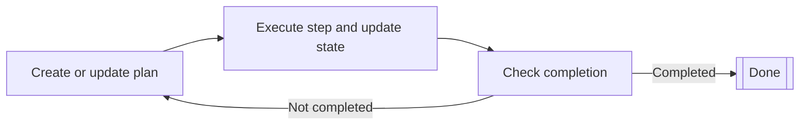

# Planner agents

Planner agents are AI agents that can plan and execute multistep tasks through iterative planning cycles. 
They continuously build or update plans, execute steps, and check completion criteria against the current state.

Planner agents are suitable for complex tasks
that require breaking down a high-level goal into smaller, actionable steps
and adapting the plan based on the results of each step.

Planner agents operate through an iterative planning cycle:

1. The planner creates or updates a plan based on the current state.
2. The planner executes a single step from the plan, updating the state.
3. The planner determines whether the plan is completed according to the current state.
    - If the plan is completed, the cycle ends.
    - If the plan is not completed, the cycle repeats from the first step.



## Prerequisites

Before you start, make sure that you have the following:

- A working Kotlin/JVM project.
- Java 17+ installed.
- A valid API key from the LLM provider that you use to implement an AI agent. For a list of all available providers, 
see [LLM providers](llm-providers.md).

!!! tip
    Use environment variables or a secure configuration management system to store your API keys.
    Avoid hardcoding API keys directly in your source code.

## Add dependencies

To use planner agents, include the following dependencies in your build configuration:

```
dependencies {
    implementation("ai.koog:koog-agents:VERSION")
}
```

For all available installation methods, see [Install Koog](getting-started.md#install-koog).

## Simple LLM-based planners

Simple LLM-based planners use LLMs to generate and evaluate plans. 
They operate on a string-based state and execute steps through LLM requests.
String-based state means that the agent state is noted as a single string,
where the agent accepts an initial state string and returns the final state string as the result.

Koog provides two simple planners: 

- [SimpleLLMPlanner](https://api.koog.ai/agents/agents-planner/ai.koog.agents.planner.llm/-simple-l-l-m-planner/index.html)
    generates a plan only once at the very beginning and then follows the plan until it is completed. 
    To include replanning, extend `SimpleLLMPlanner` and override the `assessPlan` method,
    indicating when the agent should replan.
- [SimpleLLMWithCriticPlanner](https://api.koog.ai/agents/agents-planner/ai.koog.agents.planner.llm/-simple-l-l-m-with-critic-planner/index.html)
    implements the `assessPlan` method that uses an LLM.
    The method checks the validity of the plan via an LLM request and assesses whether the agent should replan.

The following example shows how to create a simple planner agent using `SimpleLLMPlanner`:

<!--- INCLUDE
import ai.koog.agents.core.agent.config.AIAgentConfig
import ai.koog.agents.planner.AIAgentPlannerStrategy
import ai.koog.agents.planner.PlannerAIAgent
import ai.koog.agents.planner.llm.SimpleLLMPlanner
import ai.koog.prompt.dsl.prompt
import ai.koog.prompt.executor.clients.openai.OpenAIModels
import ai.koog.prompt.executor.llms.all.simpleOpenAIExecutor
import kotlinx.coroutines.runBlocking
-->
```kotlin
// Create the planner
val planner = SimpleLLMPlanner()

// Wrap it in a planner strategy
val strategy = AIAgentPlannerStrategy(
    name = "simple-planner",
    planner = planner
)

// Configure the agent
val agentConfig = AIAgentConfig(
    prompt = prompt("planner") {
        system("You are a helpful planning assistant.")
    },
    model = OpenAIModels.Chat.GPT4o,
    maxAgentIterations = 50
)

// Create the planner agent
val agent = PlannerAIAgent(
    promptExecutor = simpleOpenAIExecutor(System.getenv("OPENAI_API_KEY")),
    strategy = strategy,
    agentConfig = agentConfig
)

suspend fun main() {
    // Run the agent with a task
    val result = agent.run("Create a plan to organize a team meeting")
    println(result)
}
```
<!--- KNIT example-planner-01.kt -->


## GOAP (Goal-Oriented Action Planning)

GOAP is an algorithmic planning approach that uses [A* search](https://en.wikipedia.org/wiki/A*_search_algorithm) to find optimal action sequences.
Instead of using an LLM to generate plans,
a GOAP agent automatically discovers action sequences based on predefined goals and actions.
In Koog, GOAP is implemented through a DSL that lets you define goals and actions declaratively.

GOAP planners work with three main concepts:

- **State**: Represents the current state of the world.
- **Actions**: Define what can be done, including preconditions, effects (beliefs), costs, and execution logic.
- **Goals**: Define target conditions, heuristic costs, and value functions.

A GOAP planner uses A* search to find the sequence of actions that satisfies the goal condition while minimizing total cost.

To create a GOAP agent, you need to:

1. Define the state as a data class with properties representing various aspects specific to your goal.
2. Create a [GOAPPlanner](https://api.koog.ai/agents/agents-planner/ai.koog.agents.planner.goap/-g-o-a-p-planner/index.html) instance using the [goap()](https://api.koog.ai/agents/agents-planner/ai.koog.agents.planner.goap/goap.html) function.
    1. Define actions with preconditions and beliefs using the [action()](https://api.koog.ai/agents/agents-planner/ai.koog.agents.planner.goap/-g-o-a-p-planner-builder/action.html) function.
    2. Define goals with completion conditions using the [goal()](https://api.koog.ai/agents/agents-planner/ai.koog.agents.planner.goap/-g-o-a-p-planner-builder/goal.html) function.
3. Wrap the planner with [AIAgentPlannerStrategy](https://api.koog.ai/agents/agents-planner/ai.koog.agents.planner/-a-i-agent-planner-strategy/index.html) and pass it to the [PlannerAIAgent](https://api.koog.ai/agents/agents-planner/ai.koog.agents.planner/-planner-a-i-agent/index.html) constructor.

!!! note

    The planner selects individual actions and their sequence.
    Each action includes a precondition that must hold true for the action to be executed
    and a belief that defines the predicted outcome.
    For more information about beliefs, see [State beliefs compared to actual execution](#state-beliefs-compared-to-actual-execution).

In the following example, GOAP handles the high-level planning for creating an article (outline → draft → review → publish),
while the LLM performs the actual content generation within each action.

<!--- INCLUDE
import ai.koog.agents.core.agent.config.AIAgentConfig
import ai.koog.agents.core.agent.context.AIAgentFunctionalContext
import ai.koog.agents.core.dsl.extension.requestLLM
import ai.koog.agents.planner.AIAgentPlannerStrategy
import ai.koog.agents.planner.PlannerAIAgent
import ai.koog.agents.planner.goap.goap
import ai.koog.prompt.dsl.prompt
import ai.koog.prompt.executor.clients.openai.OpenAIModels
import ai.koog.prompt.executor.llms.all.simpleOpenAIExecutor
import kotlinx.coroutines.runBlocking
import kotlin.reflect.typeOf
-->
```kotlin
// Define a state for content creation
data class ContentState(
    val topic: String,
    val hasOutline: Boolean = false,
    val outline: String = "",
    val hasDraft: Boolean = false,
    val draft: String = "",
    val hasReview: Boolean = false,
    val isPublished: Boolean = false
)

// Create GOAP planner with LLM-powered actions
val planner = goap<ContentState>(typeOf<ContentState>()) {
    // Define actions with preconditions and beliefs
    action(
        name = "Create outline",
        precondition = { state -> !state.hasOutline },
        belief = { state -> state.copy(hasOutline = true, outline = "Outline") },
        cost = { 1.0 }
    ) { ctx, state ->
        // Use LLM to create the outline
        val response = ctx.llm.writeSession {
            appendPrompt {
                user("Create a detailed outline for an article about: ${state.topic}")
            }
            requestLLM()
        }
        state.copy(hasOutline = true, outline = response.content)
    }

    action(
        name = "Write draft",
        precondition = { state -> state.hasOutline && !state.hasDraft },
        belief = { state -> state.copy(hasDraft = true, draft = "Draft") },
        cost = { 2.0 }
    ) { ctx, state ->
        // Use LLM to write the draft
        val response = ctx.llm.writeSession {
            appendPrompt {
                user("Write an article based on this outline:\n${state.outline}")
            }
            requestLLM()
        }
        state.copy(hasDraft = true, draft = response.content)
    }

    action(
        name = "Review content",
        precondition = { state -> state.hasDraft && !state.hasReview },
        belief = { state -> state.copy(hasReview = true) },
        cost = { 1.0 }
    ) { ctx, state ->
        // Use LLM to review the draft
        val response = ctx.llm.writeSession {
            appendPrompt {
                user("Review this article and suggest improvements:\n${state.draft}")
            }
            requestLLM()
        }
        println("Review feedback: ${response.content}")
        state.copy(hasReview = true)
    }

    action(
        name = "Publish",
        precondition = { state -> state.hasReview && !state.isPublished },
        belief = { state -> state.copy(isPublished = true) },
        cost = { 1.0 }
    ) { ctx, state ->
        println("Publishing article...")
        state.copy(isPublished = true)
    }
    
    // Define the goal with a completion condition
    goal(
        name = "Published article",
        description = "Complete and publish the article",
        condition = { state -> state.isPublished }
    )
}

// Create and run the agent
val agentConfig = AIAgentConfig(
    prompt = prompt("writer") {
        system("You are a professional content writer.")
    },
    model = OpenAIModels.Chat.GPT4o,
    maxAgentIterations = 20
)

val agent = PlannerAIAgent(
    promptExecutor = simpleOpenAIExecutor(System.getenv("OPENAI_API_KEY")),
    strategy = AIAgentPlannerStrategy("content-planner", planner),
    agentConfig = agentConfig
)

suspend fun main() {
    val result = agent.run(ContentState(topic = "The Future of AI in Software Development"))
    println("Final state: $result")
}
```
<!--- KNIT example-planner-02.kt -->


## Advanced GOAP features

### Custom cost functions

As A* search uses cost as a factor in finding the optimal sequence of actions,
you can define custom cost functions for actions and goals to guide the planner:

```kotlin
action(
    name = "Expensive operation",
    precondition = { true },
    belief = { state -> state.copy(operationDone = true) },
    cost = { state ->
        // Dynamic cost based on state
        if (state.hasOptimization) 1.0 else 10.0
    }
) { ctx, state ->
    // Execute action
    state.copy(operationDone = true)
}
```

### State beliefs compared to actual execution

GOAP distinguishes between the concepts of beliefs (optimistic predictions) and actual execution:

- **Belief**: What the planner thinks will happen, used for planning.
- **Execution**: What actually happens, used for real state updates.

This allows the planner to make plans based on expected outcomes while handling actual results properly:

```kotlin
action(
    name = "Attempt complex task",
    precondition = { state -> !state.taskComplete },
    belief = { state ->
        // Optimistic belief: task will succeed
        state.copy(taskComplete = true)
    },
    cost = { 5.0 }
) { ctx, state ->
    // Actual execution might fail or have different results
    val success = performComplexTask()
    state.copy(
        taskComplete = success,
        attempts = state.attempts + 1
    )
}
```
