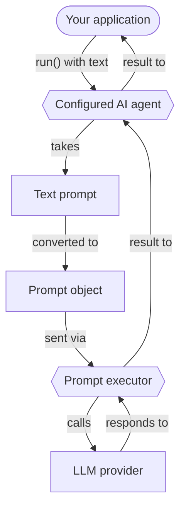

# Prompts

Prompts are instructions for Large Language Models (LLMs) that guide them in generating responses.
They define the content and structure of your interactions with LLMs.
This section describes how to create and run prompts with Koog.

## Creating prompts

In Koog, all prompts are represented as [**Prompt**](https://api.koog.ai/prompt/prompt-model/ai.koog.prompt.dsl/-prompt/index.html)
objects. A Prompt object contains:

- **ID**: A unique identifier for the prompt.
- **Messages**: A list of messages that represent the conversation with the LLM.
- **Parameters**: Optional [LLM configuration parameters](https://api.koog.ai/prompt/prompt-model/ai.koog.prompt.params/-l-l-m-params/index.html)
  (such as temperature, tool choice, and others).

All Prompt objects are structured prompts defined using the Kotlin DSL, which lets you specify the structure of the conversation.

!!! note
    AI agents let you provide a simple text prompt instead of creating a Prompt object.
    They automatically convert the text prompt to the Prompt object and send it to the LLM for execution.
    This is useful for a [basic agent](basic-agents.md) that only needs to run a single request.


<div class="grid cards" markdown>

-   :material-code-braces:{ .lg .middle } [**Structured prompts**](structured-prompts.md)

    ---

    Create type-safe structured prompts for complex multi-turn conversations.

-   :material-multimedia:{ .lg .middle } [**Multimodal inputs**](multimodal-inputs.md)

    ---

    Send images, audio, video, and documents along with text in your structured prompts.

</div>

## Running prompts

Koog provides two levels of abstraction for running prompts against LLMs: LLM clients and prompt executors.
They only accept Prompt objects and can be used for direct prompt execution, without an AI agent.
The execution flow is the same for both clients and executors:


<div class="grid cards" markdown>

-   :material-arrow-right-bold:{ .lg .middle } [**LLM clients**](llm-clients.md)

    ---

    Low‑level interfaces for direct interaction with specific LLM providers.
    Use them when you work with a single provider and do not need advanced lifecycle management.

-   :material-swap-horizontal:{ .lg .middle } [**Prompt executors**](prompt-executors.md)

    ---

    High-level abstractions that manage the lifecycles of one or multiple LLM clients.
    Use them when you need a unified API for running prompts across multiple providers,
    with dynamic switching between them and fallbacks.

</div>

If you want to run a simple text prompt, wrap it in a Prompt object using the Kotlin DSL,
or use an AI agent, which automatically does this for you.
Here is the execution flow for the agent:



<!--- INCLUDE
import ai.koog.agents.core.agent.AIAgent
import ai.koog.prompt.executor.clients.openai.OpenAIModels
import ai.koog.prompt.executor.llms.all.simpleOpenAIExecutor
import kotlinx.coroutines.runBlocking

val apiKey = System.getenv("OPENAI_API_KEY")

fun main() = runBlocking {
-->
<!--- SUFFIX
}
-->
```kotlin
// Create an agent
val agent = AIAgent(
    promptExecutor = simpleOpenAIExecutor(apiKey),
    llmModel = OpenAIModels.Chat.GPT4o
)

// Run the agent
val result = agent.run("What is Koog?")
```
<!--- KNIT example-prompts-01.kt -->

## Optimizing performance and handling failures

Koog allows you to optimize performance and handle failures when running prompts.

<div class="grid cards" markdown>

-   :material-cached:{ .lg .middle } [**LLM response caching**](llm-response-caching.md)

    ---

    Cache LLM responses to optimize performance and reduce costs for repeated requests.

-   :material-shield-check:{ .lg .middle } [**Handling failures**](handling-failures.md)

    ---

    Use built-in retries, timeouts, and other error handling mechanisms in your application.

</div>
