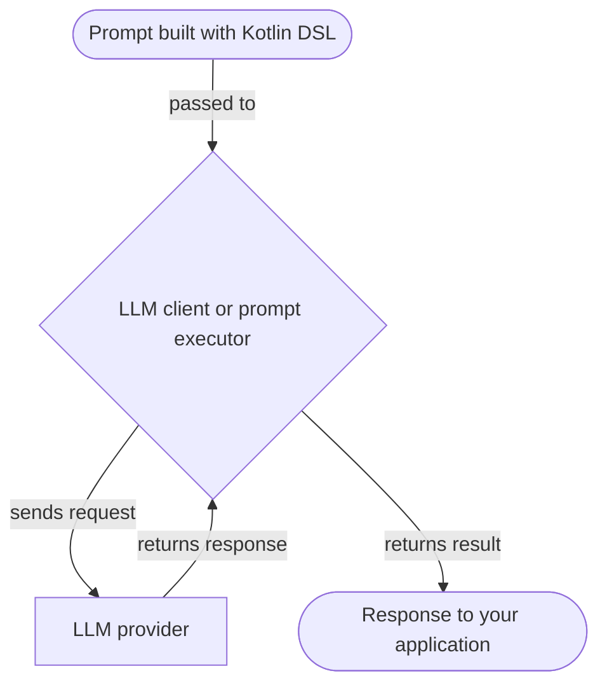

# Prompts

Prompts are instructions for Large Language Models (LLMs) that guide them in generating responses.
They define the content and structure of your interactions with LLMs.
This section describes how to create and run prompts with Koog.

## Creating prompts

In Koog, prompts are instances of the [**Prompt**](https://api.koog.ai/prompt/prompt-model/ai.koog.prompt.dsl/-prompt/index.html) 
data class with the following properties:

- `id`: A unique identifier for the prompt.
- `messages`: A list of messages that represent the conversation with the LLM.
- `params`: Optional [LLM configuration parameters](prompt-creation/index.md#prompt-parameters) (such as temperature, tool choice, and others).

Although you can instantiate the `Prompt` class directly,
the recommended way to create prompts is by using the [Kotlin DSL](prompt-creation/index.md), 
which provides a structured way to define the conversation.

<!--- INCLUDE
import ai.koog.prompt.dsl.prompt
-->
```kotlin
val myPrompt = prompt("hello-koog") {
    system("You are a helpful assistant.")
    user("What is Koog?")
}
```
<!--- KNIT example-prompts-01.kt -->

!!! note
    AI agents can take a simple text prompt as input.
    They automatically convert the text prompt to the Prompt object and send it to the LLM for execution.
    This is useful for a [basic agent](../agents/basic-agents.md)
    that only needs to run a single request and does not require complex conversation logic.

## Running prompts

Koog provides two levels of abstraction for running prompts against LLMs: LLM clients and prompt executors.
Both accept Prompt objects and can be used for direct prompt execution, without an AI agent.
The execution flow is the same for both clients and executors:



<div class="grid cards" markdown>

-   :material-arrow-right-bold:{ .lg .middle } [**LLM clients**](llm-clients.md)

    ---

    Low‑level interfaces for direct interaction with specific LLM providers.
    Use them when you work with a single provider and do not need advanced lifecycle management.

-   :material-swap-horizontal:{ .lg .middle } [**Prompt executors**](prompt-executors.md)

    ---

    High-level abstractions that manage the lifecycles of one or multiple LLM clients.
    Use them when you need a unified API for running prompts across multiple providers,
    with dynamic switching between them and fallbacks.

</div>

## Optimizing performance and handling failures

Koog allows you to optimize performance and handle failures when running prompts.

<div class="grid cards" markdown>

-   :material-cached:{ .lg .middle } [**LLM response caching**](llm-response-caching.md)

    ---

    Cache LLM responses to optimize performance and reduce costs for repeated requests.

-   :material-shield-check:{ .lg .middle } [**Handling failures**](handling-failures.md)

    ---

    Use built-in retries, timeouts, and other error handling mechanisms in your application.

</div>

## Prompts in AI agents

In Koog, AI agents maintain and manage prompts during their lifecycle.
While LLM clients or executors are used to run prompts, agents handle the flow of prompt updates, ensuring the 
conversation history remains relevant and consistent.

The prompt lifecycle in an agent usually includes several stages:

1. Initial prompt setup.
2. Automatic prompt updates.
3. Context window management.
4. Manual prompt management.

### Initial prompt setup

When you [initialize an agent](../getting-started.md#create-your-first-koog-agent),
you can define a [system message](prompt-creation/index.md#system-message) that sets the agent's behavior.
Then, when you call the agent's `run()` method,
you typically provide an initial [user message](prompt-creation/index.md#user-messages) as input.
Together, these messages form the agent's initial prompt. For example: 

<!--- INCLUDE
import ai.koog.agents.core.agent.AIAgent
import ai.koog.prompt.executor.clients.openai.OpenAIModels
import ai.koog.prompt.executor.llms.all.simpleOpenAIExecutor
import kotlinx.coroutines.runBlocking

val apiKey = System.getenv("OPENAI_API_KEY")

fun main() = runBlocking {
-->
<!--- SUFFIX
}
-->
```kotlin
// Create an agent
val agent = AIAgent(
    promptExecutor = simpleOpenAIExecutor(apiKey),
    systemPrompt = "You are a helpful assistant.",
    llmModel = OpenAIModels.Chat.GPT4o
)

// Run the agent
val result = agent.run("What is Koog?")
```
<!--- KNIT example-prompts-02.kt -->

In the example, the agent automatically converts the text prompt to the Prompt object and sends it to the prompt executor:


For more advanced configurations, you can also use [AIAgentConfig](https://api.koog.ai/agents/agents-core/ai.koog.agents.core.agent.config/-a-i-agent-config/index.html)
to define the agent's initial prompt.

### Automatic prompt updates

As the agent runs its strategy, [predefined nodes](../nodes-and-components.md) automatically update the prompt.
For example:

- [`nodeLLMRequest`](../nodes-and-components.md#nodellmrequest): Appends a user message to the prompt and captures the LLM response.
- [`nodeLLMSendToolResult`](../nodes-and-components.md#nodellmsendtoolresult): Appends tool execution results to the conversation.
- [`nodeAppendPrompt`](../nodes-and-components.md#nodeappendprompt): Inserts specific messages into the prompt at any point in the workflow.

### Context window management

To avoid exceeding the LLM context window in long-running interactions, agents can use the
[history compression](../history-compression.md) feature.

### Manual prompt management

For complex workflows, you can manage the prompt manually using [LLM sessions](../sessions.md).
In an agent strategy or custom node, you can use `llm.writeSession` to access and change the `Prompt` object.
This lets you add, remove, or reorder messages as needed.
